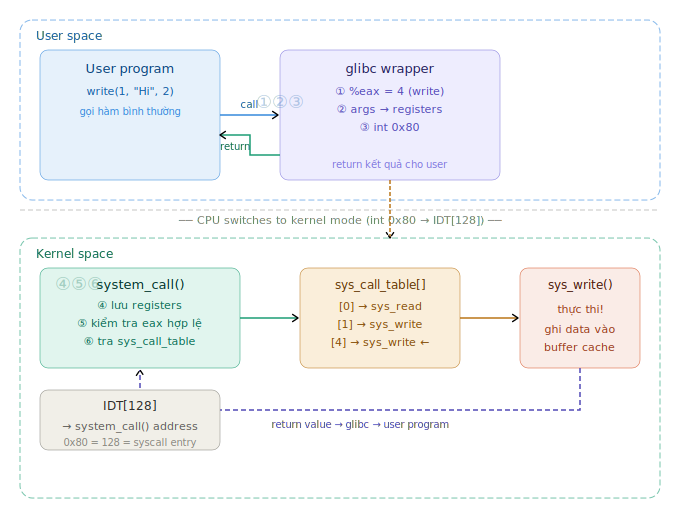
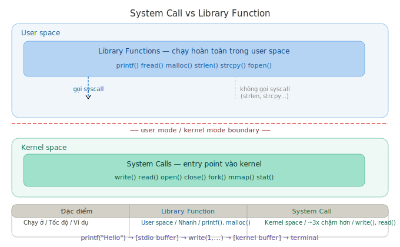

# System Calls — Tổng kết kiến thức

> Tài liệu tổng kết toàn bộ kiến thức về System Calls từ *The Linux Programming Interface* (TLPI) — Ch3

---

## 1. Tại sao cần System Call?

### 1.1 Vấn đề

Nếu user program có thể truy cập kernel trực tiếp:

- **Stability**: Process A có thể corrupt memory của process B hoặc kernel
- **Security**: Attacker có thể ghi vào kernel memory để chiếm quyền hệ thống
- **Isolation**: Bug trong 1 process có thể crash toàn bộ hệ thống

### 1.2 Giải pháp — 2 CPU modes

CPU có 2 modes hoàn toàn tách biệt:

```
┌─────────────────────────────────────────────┐
│              USER MODE                       │
│  Chỉ truy cập được memory của process đó    │
│  Không được tác động vào hardware trực tiếp  │
├─────────────────────────────────────────────┤
│              KERNEL MODE                     │
│  Truy cập được mọi thứ                      │
│  Kiểm soát toàn bộ hardware                 │
└─────────────────────────────────────────────┘
```

**System call = cơ chế chuyển đổi CÓ KIỂM SOÁT từ user mode → kernel mode**

> **So sánh STM32 bare metal:**
> - STM32: Program tác động thẳng vào thanh ghi — không có sự phân tách
> - Bug có thể crash toàn bộ MCU, phải reset board
> - Linux: Bug chỉ kill process đó, hệ thống vẫn chạy bình thường

---

## 2. Flow của System Call (x86)


### 2.1 Tại sao dùng `int 0x80` (128)?

```
IDT (Interrupt Descriptor Table):
┌─────┬──────────────────────────────┐
│  0  │ Divide by zero               │
│  1  │ Debug                        │
│ ... │ CPU exceptions (0x00-0x1F)   │ ← Intel reserved
│ 32  │ Hardware interrupts           │
│ ... │ (keyboard, disk, network...) │ ← 0x20-0x7F
│ 128 │ system_call() ◄──────────────│ ← 0x80 = Linux syscall entry
│ ... │ ...                          │
│ 255 │ ...                          │
└─────┴──────────────────────────────┘

→ 0x80 = 128: không conflict với CPU exceptions hay hardware interrupts
→ Linus Torvalds chọn từ đầu, giữ nguyên vì backward compatibility
```

> **Lưu ý:** x86-64 dùng lệnh `syscall` thay vì `int 0x80` — nhanh hơn vì không cần tra IDT.

### 2.2 Tại sao dùng syscall number thay vì địa chỉ hàm?

```
❌ Nếu dùng địa chỉ hàm:
   User truyền địa chỉ bất kỳ → có thể trỏ đến code độc hại trong kernel
   → Attacker chiếm quyền hệ thống!

✅ Dùng syscall number:
   User chỉ truyền số nguyên (ví dụ: 4)
   Kernel tự tra sys_call_table[4] → sys_write()
   User KHÔNG THỂ tự chỉ định địa chỉ kernel
   → Kernel kiểm soát hoàn toàn entry point
```

**Pattern "index vào bảng" — Linux dùng ở nhiều chỗ:**

```
syscall number → sys_call_table[]  → kernel function
fd             → fd table[]        → open file entry
inode number   → inode table[]     → file metadata
```

---

## 3. errno và Error Handling

### 3.1 Cơ chế

Khi syscall thất bại:
- Return **-1**
- Lưu mã lỗi cụ thể vào biến toàn cục **`errno`**

```
open() thất bại
    ↓
kernel set errno = 2  (ENOENT = No such file)
    ↓
open() return -1
    ↓
bạn check: if (fd == -1) → đọc errno để biết lý do
```

### 3.2 2 Rules quan trọng

```
Rule 1: Chỉ đọc errno sau khi syscall return -1
Rule 2: Đọc errno NGAY LẬP TỨC — function call tiếp theo có thể ghi đè!
```

### 3.3 Code đúng chuẩn

```c
// ❌ Sai — printf() có thể ghi đè errno!
int fd = open("file.txt", O_RDONLY);
if (fd == -1) {
    printf("Có lỗi!\n");
    printf("%s\n", strerror(errno));  // errno có thể đã bị ghi đè!
}

// ✅ Đúng — lưu errno ngay lập tức
int fd = open("file.txt", O_RDONLY);
if (fd == -1) {
    int saved_errno = errno;     // lưu ngay!
    printf("Có lỗi!\n");
    printf("%s\n", strerror(saved_errno));
}

// ✅ Đơn giản nhất — dùng perror()
int fd = open("file.txt", O_RDONLY);
if (fd == -1) {
    perror("open()");  // tự đọc và in errno luôn, an toàn!
}
```

### 3.4 Một số errno phổ biến

| Giá trị | Tên | Ý nghĩa |
|---|---|---|
| 2 | ENOENT | File không tồn tại |
| 13 | EACCES | Không có quyền |
| 9 | EBADF | Bad file descriptor |
| 24 | EMFILE | Quá nhiều file đang mở |
| 11 | EAGAIN | Resource temporarily unavailable |
| 4 | EINTR | Interrupted by signal |

### 3.5 errno trong multi-thread

```
Thread A set errno = ENOENT
Thread B set errno = EACCES  ← ghi đè errno của Thread A!

→ Giải pháp: Modern Linux dùng thread-local storage
→ Mỗi thread có errno RIÊNG — không ảnh hưởng nhau
```

---

## 4. Overhead của System Call

### 4.1 Tại sao syscall chậm hơn function call?

```
Function call thường:
┌──────────┐     ┌──────────┐
│ caller   │────▶│ function │  ~0.1 microseconds
└──────────┘     └──────────┘

System call:
┌──────────┐     ┌──────────┐     ┌──────────┐     ┌──────────┐
│ user     │────▶│ context  │────▶│ kernel   │────▶│ context  │
│ program  │     │ save     │     │ handler  │     │ restore  │
└──────────┘     └──────────┘     └──────────┘     └──────────┘
                                                    ~0.3 microseconds
```

**4 nguyên nhân gây overhead:**

```
① Context save/restore  → lưu toàn bộ registers vào kernel stack
② Mode switch           → CPU chuyển privilege level, kiểm tra bảo mật
③ Stack switch          → user và kernel dùng stack riêng
④ Cache flush           → TLB cache có thể bị invalidate khi switch
```

### 4.2 Tối ưu — Minimize syscalls

```c
// ❌ Tệ: 1 triệu syscalls → rất chậm
for (int i = 0; i < 1000000; i++)
    write(fd, &buf[i], 1);

// ✅ Tốt: 1 syscall → nhanh hơn ~1000x
write(fd, buf, 1000000);
```

> **So sánh STM32:** Không có syscall overhead — function gọi thẳng vào hardware. Nhưng cũng không có isolation và security.

---

## 5. System Call vs Library Function


**Ví dụ liên kết:**

```
printf("Hello")
    ↓ glibc buffer (stdio buffer)
    ↓ khi buffer đầy hoặc gặp \n
write(1, "Hello", 5)    ← system call
    ↓
kernel buffer cache
    ↓
terminal/disk
```

| | Library Function | System Call |
|---|---|---|
| Ví dụ | `printf()`, `strlen()`, `malloc()` | `write()`, `open()`, `read()` |
| Chạy ở | User space | Kernel space |
| Tốc độ | Nhanh | Chậm hơn ~3x |
| Gọi syscall? | Có thể có hoặc không | Luôn luôn là syscall |

---

## 6. Checklist câu hỏi phỏng vấn

- [ ] System call là gì và tại sao cần thiết?
- [ ] Giải thích flow đầy đủ của system call từ user space đến kernel
- [ ] Tại sao dùng `int 0x80`? Số 128 có ý nghĩa gì?
- [ ] Tại sao dùng syscall number thay vì địa chỉ hàm trực tiếp?
- [ ] errno hoạt động như thế nào? Những rule nào khi dùng errno?
- [ ] Sự khác nhau giữa system call và library function?
- [ ] Tại sao system call chậm hơn function call thường?
- [ ] Làm thế nào để tối ưu khi phải gọi nhiều syscalls?
- [ ] errno trong multi-thread hoạt động thế nào?

---

## 7. So sánh Linux vs STM32 Bare Metal

| | STM32 Bare Metal | Linux |
|---|---|---|
| Truy cập hardware | Thẳng vào thanh ghi | Qua kernel (syscall) |
| Bug ghi sai địa chỉ | Crash toàn MCU | Chỉ kill process đó |
| Isolation | Không có | User/kernel mode |
| Security | Không có | Kernel kiểm soát entry point |
| Overhead | Không có | ~0.3 microseconds/syscall |
| Nhiều chương trình | Khó, conflict | Kernel quản lý, an toàn |

---

*Tài liệu này được tổng kết từ TLPI Chapter 3 — System Programming Concepts*
