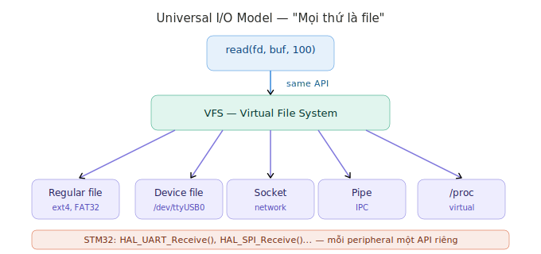
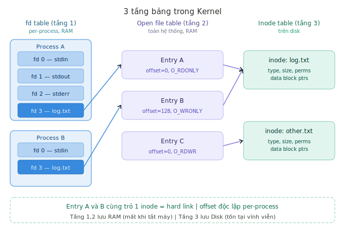
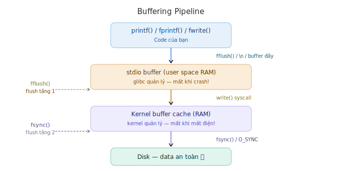
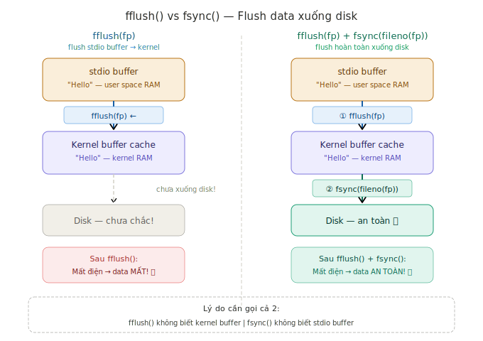

# File I/O — Tổng kết kiến thức

> Tài liệu tổng kết toàn bộ kiến thức về File I/O từ *The Linux Programming Interface* (TLPI) — Ch4, 5, 13, 14, 15, 18

---

## Mục lục

| # | Nội dung |
|---|---|
| 1 | [Universal I/O Model — "Mọi thứ là file"](#1-universal-io-model--mọi-thứ-là-file) |
| 2 | [7 Loại file trong Linux](#2-7-loại-file-trong-linux) |
| 3 | [File Descriptor](#3-file-descriptor) |
| 4 | [Ba tầng bảng trong Kernel](#4-ba-tầng-bảng-trong-kernel) |
| 5 | [VFS — Virtual File System](#5-vfs--virtual-file-system) |
| 6 | [Inode và Directory](#6-inode-và-directory) |
| 7 | [Hard Link vs Symbolic Link](#7-hard-link-vs-symbolic-link) |
| 8 | [open()](#8-open) |
| 9 | [read()](#9-read) |
| 10 | [lseek()](#10-lseek) |
| 11 | [write()](#11-write) |
| 12 | [close() và fd leak](#12-close-và-fd-leak) |
| 13 | [Buffering — fflush() và fsync()](#13-buffering--fflush-và-fsync) |
| 14 | [stat(), lstat(), fstat()](#14-stat-lstat-fstat) |
| 15 | [Permissions](#15-permissions) |
| 16 | [dup() và dup2()](#16-dup-và-dup2) |
| 17 | [fcntl()](#17-fcntl) |
| 18 | [File Locking](#18-file-locking) |
| 19 | [Checklist câu hỏi phỏng vấn](#19-checklist-câu-hỏi-phỏng-vấn) |
| 20 | [So sánh Linux vs STM32 Bare Metal](#20-so-sánh-linux-vs-stm32-bare-metal) |

---

## 1. Universal I/O Model — "Mọi thứ là file"



Linux dùng cùng 4 syscall cho **mọi loại file**:

```
open()   → mở file, nhận fd
read()   → đọc data từ fd
write()  → ghi data vào fd
close()  → đóng fd, giải phóng tài nguyên
```

**Tại sao Linux thiết kế như vậy:**
- **Uniformity**: Developer chỉ học 1 API thay vì hàng chục API riêng
- **Access control**: Process không tác động thẳng vào hardware — kernel kiểm soát
- **Isolation**: Bug trong 1 process không ảnh hưởng process khác

> **So sánh STM32:** `HAL_UART_Receive()`, `HAL_SPI_Receive()`... — mỗi peripheral một API riêng, tác động thẳng vào thanh ghi.

---

## 2. 7 Loại file trong Linux

| Ký tự | Loại | Ví dụ |
|---|---|---|
| `-` | Regular file | log.txt, firmware.bin |
| `d` | Directory | /home, /etc, /dev |
| `l` | Symbolic link | /dev/serial0 → /dev/ttyAMA0 |
| `c` | Character device | /dev/ttyUSB0 (UART), /dev/null |
| `b` | Block device | /dev/sda (HDD), /dev/mmcblk0 |
| `p` | Named pipe (FIFO) | /tmp/mypipe |
| `s` | Socket | /var/run/app.sock |

**Kiểm tra loại file bằng `stat()`:**

```c
struct stat sb;
stat("path", &sb);
if (S_ISREG(sb.st_mode))  printf("Regular file\n");
if (S_ISCHR(sb.st_mode))  printf("Character device\n");
if (S_ISLNK(sb.st_mode))  printf("Symlink\n");
```

---

## 3. File Descriptor

File descriptor (fd) là **số nguyên nhỏ** — index vào fd table của process:

| fd | Tên | Mặc định |
|---|---|---|
| 0 | stdin | Bàn phím |
| 1 | stdout | Terminal |
| 2 | stderr | Terminal |
| 3+ | User files | Từ `open()` |

> **Pattern:** fd là index vào bảng — giống syscall number là index vào sys_call_table!

---

## 4. Ba tầng bảng trong Kernel



**Vòng đời của entry (tầng 2):**

```
open()   → TẠO entry trong open file table
read()   → CHỈ cập nhật offset trong entry
write()  → CHỈ cập nhật offset trong entry
lseek()  → CHỈ thay đổi offset trong entry
close()  → XÓA entry khỏi open file table
```

| Tầng | Lưu gì | Scope | Nơi lưu |
|---|---|---|---|
| fd table | Index số nguyên | Per-process | RAM |
| Open file table | offset, flags | Toàn hệ thống | RAM |
| Inode table | type, size, permissions, data | File system | Disk |

---

## 5. VFS — Virtual File System

```
User: read(fd, buf, 100)
          ↓
    VFS — vfs_read() (interface chuẩn)
    ↙       ↓       ↘       ↘
 ext4    FAT32     NFS    /proc
  ↓        ↓        ↓       ↓
HDD      USB    Network   RAM
```

| File system | Mục đích | Bare metal tương đương |
|---|---|---|
| ext4 | Lưu trữ lâu dài, journaling | Flash với wear leveling |
| FAT32 | Tương thích đa nền tảng | SD card trên STM32 |
| NFS | File qua network | Không có trên bare metal |
| /proc | Xem trạng thái kernel | Đọc thanh ghi trực tiếp |

---

## 6. Inode và Directory

**Inode lưu mọi thứ — TRỪ tên file:**

```
Disk partition
┌─────────────────────────┐
│ Boot block              │
├─────────────────────────┤
│ Superblock              │
├─────────────────────────┤
│ Inode table             │ ← metadata (type, size, perms, timestamps...)
├─────────────────────────┤
│ Data blocks             │ ← nội dung file + directory data
└─────────────────────────┘
```

**Directory** là file đặc biệt chứa bảng ánh xạ tên → inode:

```
Directory /home/giang/
┌─────────────┬──────────────┐
│  Tên file   │ Inode number │
├─────────────┼──────────────┤
│ log.txt     │    6422      │
│ config.txt  │    6423      │
└─────────────┴──────────────┘
```

---

## 7. Hard Link vs Symbolic Link

### 7.1 Tại sao ra đời?

**Hard link ra đời** vì tên file và inode tách biệt nhau — có thể có nhiều tên trỏ đến cùng 1 inode:

```
Không có hard link:               Có hard link:
python3.9 → inode (50MB)          python3.9 ──┐
python3   → inode (50MB copy!)    python3   ──┼──▶ inode (50MB)
python    → inode (50MB copy!)    python    ──┘
Tốn: 150MB                        Tốn: 50MB + 3 directory entries
```

**Symbolic link ra đời** vì hard link có 2 giới hạn:
- Không thể hard link **qua partition khác** — inode number chỉ unique trong cùng 1 file system
- Không thể hard link **đến directory** — tạo ra vòng lặp vô tận khi kernel duyệt cây thư mục

### 7.2 Cơ chế hoạt động

```
Hard link:
"log.txt"    ──┐
               ├──▶ inode 6422 (file thật trên disk)
"backup.txt" ──┘
st_nlink = 2  ← kernel đếm số hard links trong inode!
Xóa 1 tên → st_nlink = 1 → file vẫn còn
Xóa tên cuối → st_nlink = 0 → file bị xóa khỏi disk!

Symbolic link:
"shortcut.txt" ──▶ [chuỗi "/home/giang/log.txt"] ──▶ inode 6422
Xóa file gốc → symlink bị hỏng (dangling link)
```

### 7.3 So sánh

| | Hard link | Symbolic link |
|---|---|---|
| Cơ chế | 2 tên → 1 inode | File chứa đường dẫn |
| Xóa file gốc | File vẫn còn | Link bị hỏng |
| Khác partition | Không được | Được |
| Trỏ đến directory | Không được | Được |
| st_nlink | Tăng lên | Không thay đổi |
| Tiết kiệm disk | Có — dùng chung data blocks | Không — thêm 1 file nhỏ |

### 7.4 Command line

```bash
# Hard link
ln file.txt backup.txt          # tạo hard link
ls -la file.txt backup.txt      # xem st_nlink = 2

# Symbolic link
ln -s /dev/ttyAMA0 /dev/serial0 # tạo symlink
ls -la /dev/serial0             # lrwxrwxrwx → ttyAMA0
readlink /dev/serial0           # đọc nội dung symlink

# Xóa
unlink backup.txt               # xóa hard link (st_nlink giảm)
unlink /dev/serial0             # xóa symlink (file gốc không ảnh hưởng)
```

### 7.5 Syscalls tương ứng

```c
link("file.txt", "backup.txt");         // tạo hard link
symlink("/dev/ttyAMA0", "/dev/serial0");// tạo symlink
unlink("backup.txt");                   // xóa hard link hoặc symlink
readlink("/dev/serial0", buf, size);    // đọc nội dung symlink
```

### 7.6 File bị xóa khi nào?

Kernel theo dõi 2 counter trong inode:

```
link count  = số tên file trỏ đến inode (hard links)
open count  = số process đang mở file

File bị xóa khỏi disk khi: link count = 0 VÀ open count = 0
```

**Kỹ thuật tạo file tạm tự xóa:**

```c
int fd = open("tmp", O_RDWR | O_CREAT, 0600);
unlink("tmp");   // link count = 0, nhưng open count = 1 → chưa xóa!
// ... dùng file qua fd ...
close(fd);       // open count = 0 → file tự xóa hoàn toàn!
```

> **Embedded Linux:** `/dev/serial0 → ttyAMA0` — symlink rất hay gặp trong /dev. Dùng `stat()` để follow symlink, `lstat()` để dừng tại symlink.

---

## 8. open()

```c
int open(const char *pathname, int flags, mode_t mode);
// Returns fd on success, -1 on error
```

**Flags:**

| Flag | Ý nghĩa |
|---|---|
| `O_RDONLY` | Chỉ đọc |
| `O_WRONLY` | Chỉ ghi |
| `O_RDWR` | Đọc và ghi |
| `O_CREAT` | Tạo file nếu chưa tồn tại |
| `O_TRUNC` | Xóa nội dung file cũ |
| `O_APPEND` | Ghi nối cuối file (atomic!) |
| `O_EXCL` | Lỗi nếu file đã tồn tại |
| `O_NONBLOCK` | Nonblocking mode |
| `O_SYNC` | Mỗi write() tự flush xuống disk |

**Atomicity với `O_APPEND`:**

```
Không có O_APPEND:
Process A lseek đến cuối → Process B chen vào → A ghi đè!

Có O_APPEND:
Process A: atomic(seek đến cuối + write) — không thể bị interrupt
```

---

## 9. read()

```c
ssize_t read(int fd, void *buf, size_t count);
// Returns: số bytes đọc, 0 = EOF, -1 = lỗi
```

- Đọc từ **offset hiện tại** trong open file table (tầng 2)
- **Tự động tăng offset** sau mỗi lần đọc
- **Blocking** với device/socket/pipe — chờ đến khi có data
- **Non-blocking** với regular file — return 0 (EOF) ngay

```
File: "Hello Linux!\n"

read(fd, buf, 5) → "Hello", offset: 0→5
read(fd, buf, 5) → " Linu", offset: 5→10
read(fd, buf, 5) → "x!\n",  offset: 10→13
read(fd, buf, 5) → return 0 (EOF)
```

---

## 10. lseek()

```c
off_t lseek(int fd, off_t offset, int whence);
// Returns: offset mới, -1 = lỗi
```

`lseek()` thay đổi offset trong **tầng 2** (open file table).

| whence | Di chuyển từ | Thường dùng |
|---|---|---|
| `SEEK_SET` | Đầu file | `lseek(fd, 0, SEEK_SET)` → về đầu |
| `SEEK_CUR` | Vị trí hiện tại | `lseek(fd, 0, SEEK_CUR)` → lấy offset |
| `SEEK_END` | Cuối file | `lseek(fd, 0, SEEK_END)` → cuối file |

**File holes:** `lseek()` vượt cuối file rồi `write()` → tạo null bytes không chiếm dung lượng thật.

---

## 11. write()

```c
ssize_t write(int fd, const void *buf, size_t count);
// Returns: số bytes đã ghi, -1 = lỗi
```

- Ghi vào **kernel buffer cache** trước — không xuống disk ngay
- **Partial write** có thể xảy ra — return value < count

---

## 12. close() và fd leak

```c
int close(int fd);
// Returns: 0 on success, -1 on error
```

**4 điều ẩn sâu:**

```c
// ① Luôn check return value
if (close(fd) == -1) perror("close");

// ② Dùng fsync() trước nếu cần đảm bảo data xuống disk
fsync(fd);
close(fd);

// ③ File bị xóa khi link count + open count = 0
// Kỹ thuật tạo file tạm tự xóa:
int fd = open("tmp", O_RDWR | O_CREAT, 0600);
unlink("tmp");  // xóa tên, file vẫn còn vì fd đang mở
close(fd);      // lúc này file mới thật sự biến mất!

// ④ Chỉ gọi close() 1 lần — gọi lần 2 là undefined behavior
```

**fd leak — bug điển hình embedded Linux 24/7:**

```c
while (1) {
    int fd = open("/dev/sensor", O_RDONLY);
    read(fd, buf, 10);
    // quên close(fd)!
    sleep(1);
}
// RLIMIT_NOFILE = 1024 → sau ~17 phút → crash!
```

---

## 13. Buffering — fflush() và fsync()

### 13.1 Pipeline tổng quan



```
printf() / fprintf()
      ↓
stdio buffer (user RAM)    ← tầng 1: glibc quản lý
      ↓ write() syscall
Kernel buffer cache (RAM)  ← tầng 2: kernel quản lý
      ↓
Disk                       ← data thật sự an toàn
```

### 13.2 stdio Buffer (Tầng 1)

**3 chế độ:**

| Chế độ | Flush khi nào | Dùng cho |
|---|---|---|
| Block buffering | Buffer đầy (~4096 bytes) | File thông thường |
| Line buffering | Gặp `\n` | Terminal (stdout) |
| No buffering | Ngay lập tức | stderr |

**Khi nào stdio buffer được flush:**

```
① fflush(fp)       → flush thủ công ngay lập tức
② Gặp \n           → flush (line buffering mode)
③ Buffer đầy       → flush tự động
④ fclose(fp)       → flush rồi đóng
⑤ exit() / return  → glibc flush tất cả buffers
⑥ Program crash    → KHÔNG flush → data mất!
⑦ _exit()          → KHÔNG flush → data mất!
```

**Bug hay gặp — thiếu \n:**

```c
// ❌ Bug — cả 2 dòng xuất hiện cùng lúc sau 5 giây!
printf("Starting sensor read...");  // không có \n → nằm trong buffer
read(fd_sensor, buf, 10);           // mất 5 giây
printf("Done!\n");

// ✅ Fix — dùng fflush()
printf("Starting sensor read...");
fflush(stdout);                     // flush ngay!
read(fd_sensor, buf, 10);
printf("Done!\n");
```

### 13.3 fflush() vs fsync()



**fflush() — flush tầng 1 (stdio → kernel):**

```c
#include <stdio.h>

FILE *fp = fopen("config.txt", "w");
fprintf(fp, "value=123\n");

fflush(fp);
// Data đã vào kernel buffer cache
// Nhưng CHƯA xuống disk!
// Mất điện lúc này → data MẤT!
```

**fsync() — flush tầng 2 (kernel → disk):**

```c
#include <unistd.h>

int fd = open("config.txt", O_WRONLY);
write(fd, "value=123\n", 10);

fsync(fd);
// Data đã xuống disk thật sự
// Mất điện lúc này → data AN TOÀN!
```

**Kết hợp cả 2 — đảm bảo hoàn toàn:**

```c
FILE *fp = fopen("config.txt", "w");
fprintf(fp, "value=123\n");

fflush(fp);              // ① stdio buffer → kernel
fsync(fileno(fp));       // ② kernel buffer → disk
fclose(fp);              // ③ đóng file

// fileno(fp) chuyển FILE* sang fd
```

**Tại sao cần gọi cả 2:**

```
fflush() không biết kernel buffer tồn tại
fsync()  không biết stdio buffer tồn tại

→ Thiếu fflush(): data vẫn trong stdio buffer → fsync() không làm gì!
→ Thiếu fsync():  data vào kernel nhưng chưa xuống disk → mất điện = mất data
```

### 13.4 fdatasync() — phiên bản nhẹ hơn fsync()

```c
fdatasync(fd);  // chỉ flush data, không flush metadata (timestamps...)
                // nhanh hơn fsync() một chút
```

### 13.5 O_SYNC flag — auto flush mỗi lần write

```c
int fd = open("critical.txt", O_WRONLY | O_SYNC);
write(fd, data, size);  // mỗi write() tự flush xuống disk luôn!
                        // chậm nhất nhưng đơn giản nhất
```

### 13.6 Khi nào cần fsync() trong embedded Linux

| Tình huống | Cần fsync()? |
|---|---|
| Ghi log thông thường | Không cần |
| Ghi config file | **Cần** |
| Ghi firmware update | **Cần** — mất điện giữa chừng → brick! |
| Database transaction | **Cần** |

> **So sánh STM32:** `f_sync()` trong FatFS = `fsync()` trong Linux. Không gọi trước khi mất điện → file system corrupt.

---

## 14. stat(), lstat(), fstat()

```c
int stat(const char *pathname, struct stat *statbuf);   // follow symlink
int lstat(const char *pathname, struct stat *statbuf);  // dừng tại symlink
int fstat(int fd, struct stat *statbuf);                // dùng fd
```

**struct stat — các fields quan trọng:**

```c
struct stat {
    dev_t     st_dev;     // device chứa file (identify file system)
    ino_t     st_ino;     // inode number
    mode_t    st_mode;    // file type + permissions
    nlink_t   st_nlink;   // số hard links
    uid_t     st_uid;     // owner user ID
    gid_t     st_gid;     // owner group ID
    off_t     st_size;    // size logic (bytes)
    blksize_t st_blksize; // block size tối ưu cho I/O
    blkcnt_t  st_blocks;  // số 512-byte blocks thật sự trên disk
    time_t    st_atime;   // last access time
    time_t    st_mtime;   // last modification time
    time_t    st_ctime;   // last status change time
};
```

**3 timestamps:**

| Field | Cập nhật khi | Dùng để |
|---|---|---|
| `st_atime` | read() | Audit log |
| `st_mtime` | write() | Detect nội dung thay đổi |
| `st_ctime` | write(), chmod(), chown() | Detect bất kỳ thay đổi nào |

> **Lưu ý:** `st_ctime` ≠ creation time! Là "status change time"

**st_size vs st_blocks vs st_blksize:**

```
st_size    = 5000 bytes  ← size logic của file
st_blksize = 4096 bytes  ← block size tối ưu để read/write
st_blocks  = 16          ← số 512-byte sectors thật trên disk

→ st_blocks × 512 ≠ st_size nếu có file holes!
→ Dùng st_blksize để read/write hiệu quả nhất
```

**stat() vs lstat() vs fstat():**

| | stat() | lstat() | fstat() |
|---|---|---|---|
| Chỉ định file | pathname | pathname | fd |
| Xử lý symlink | Follow | Dừng tại symlink | Không liên quan |
| Tốc độ | Chậm | Chậm | Nhanh nhất |
| Dùng khi | Cần info file đích | Cần info symlink | Đã có fd rồi |

---

## 15. Permissions

**Cấu trúc:**

```
-  rw-  r--  r--
↑   ↑    ↑    ↑
│  owner group other
└── loại file (- = regular)
```

**Octal notation:**

```
r = 4, w = 2, x = 1

rw-r--r-- = 644
rwxr-xr-x = 755
rw------- = 600
```

> **Quan trọng:** Luôn dùng `0644` (có số 0 đầu = octal), không phải `644` (decimal)!

**chmod() và chown():**

```c
chmod("file.txt", 0644);          // thay đổi permissions
chown("file.txt", uid, gid);      // thay đổi ownership — chỉ root!
```

```bash
chmod 644 file.txt                # octal
chmod u+x script.sh               # symbolic — thêm execute
chmod go-w file.txt               # bỏ write của group và other
chown root:appgroup /etc/app.conf # đổi owner và group
```

**umask — bộ lọc tự động:**

```
permissions thực tế = permissions yêu cầu & (~umask)

open("file", O_CREAT, 0666) với umask = 022:
0666 & ~022 = 0644

→ umask 022: bỏ write của group và other
→ umask 027: bỏ write group, bỏ toàn bộ other
→ umask 077: chỉ owner có quyền
```

```bash
umask          # xem umask hiện tại
umask 027      # đặt umask an toàn hơn cho embedded
```

---

## 16. dup() và dup2()

```c
int dup(int oldfd);              // kernel chọn fd nhỏ nhất available
int dup2(int oldfd, int newfd);  // dùng đúng fd=newfd
```

**Tác động lên 3 tầng bảng:**

```
Trước dup2(fd=3, 1):           Sau dup2(fd=3, 1):
fd=1 → Entry terminal          fd=1 → Entry file  ← đổi!
fd=3 → Entry file              fd=3 → Entry file

→ printf() ghi vào fd=1 → vào file thay vì terminal!
```

**Pattern redirect + restore:**

```c
int saved = dup(1);              // backup stdout
int fd = open("log.txt", O_WRONLY | O_CREAT, 0644);
dup2(fd, 1);                     // redirect stdout → file
close(fd);
printf("Ghi vào file!\n");
dup2(saved, 1);                  // restore stdout
close(saved);
printf("Ghi ra terminal!\n");
```

**Dùng khi nào:**

| Tình huống | Dùng hàm nào |
|---|---|
| Cần bản sao fd, không quan tâm số | `dup()` |
| Redirect stdin/stdout/stderr | `dup2()` |
| Backup fd trước khi redirect | `dup()` |

---

## 17. fcntl()

```c
int fcntl(int fd, int cmd, ... /* arg */);
```

**F_GETFL / F_SETFL — thay đổi flags sau khi open:**

```c
// Pattern đọc-sửa-ghi — KHÔNG ghi đè thẳng!
int flags = fcntl(fd, F_GETFL);
flags |= O_NONBLOCK;              // thêm nonblocking
fcntl(fd, F_SETFL, flags);

// ❌ Sai — ghi đè toàn bộ flags cũ!
fcntl(fd, F_SETFL, O_NONBLOCK);
```

**Blocking vs Nonblocking:**

| | Regular file | Device/Socket/Pipe |
|---|---|---|
| Không có data | return 0 (EOF) ngay | BLOCK — chờ |
| Với O_NONBLOCK | return 0 (EOF) ngay | return -1, errno=EAGAIN |

**Use case embedded Linux:**

```c
// Mở UART, sau đó chuyển sang nonblocking
int fd = open("/dev/ttyUSB0", O_RDWR);
// ... đọc blocking để chờ handshake ...
int flags = fcntl(fd, F_GETFL);
fcntl(fd, F_SETFL, flags | O_NONBLOCK);
// Từ giờ đọc nonblocking
```

---

## 18. File Locking

### flock() — Lock toàn bộ file

```c
#include <sys/file.h>
int flock(int fd, int operation);
```

| Operation | Ý nghĩa |
|---|---|
| `LOCK_SH` | Shared lock — nhiều process đọc cùng lúc |
| `LOCK_EX` | Exclusive lock — chỉ 1 process ghi |
| `LOCK_UN` | Unlock |
| `LOCK_NB` | Nonblocking — return -1 nếu không lock được |

```c
// Đảm bảo chỉ 1 instance chạy
int fd = open("/var/lock/app.lock", O_CREAT | O_RDWR, 0644);
if (flock(fd, LOCK_EX | LOCK_NB) == -1) {
    if (errno == EWOULDBLOCK) {
        printf("Program đã chạy rồi!\n");
        exit(1);
    }
}
// Làm việc...
flock(fd, LOCK_UN);  // unlock
close(fd);           // hoặc close() tự động unlock
```

> **Auto cleanup:** Process crash → kernel tự unlock khi fd bị đóng

### fcntl() Record Locking — Lock từng vùng bytes

```c
struct flock fl = {
    .l_type   = F_WRLCK,    // F_RDLCK, F_WRLCK, F_UNLCK
    .l_whence = SEEK_SET,
    .l_start  = 0,           // byte bắt đầu
    .l_len    = 100,         // số bytes (0 = đến cuối file)
};

fcntl(fd, F_SETLK, &fl);    // nonblocking
fcntl(fd, F_SETLKW, &fl);   // blocking — W = Wait
fcntl(fd, F_GETLK, &fl);    // kiểm tra ai đang giữ lock
```

**Khi nào dùng flock() vs fcntl():**

| | flock() | fcntl() |
|---|---|---|
| Lock vùng nào | Toàn bộ file | Từng vùng bytes |
| Độ phức tạp | Đơn giản | Phức tạp hơn |
| Dùng khi | Config, lock file | Database, record locking |
| POSIX | Không | Có |

---

## 19. Checklist câu hỏi phỏng vấn

**File descriptor & 3 tầng bảng:**
- [ ] File descriptor là gì? Tại sao fd bắt đầu từ 0?
- [ ] 3 tầng bảng trong kernel — mỗi tầng lưu gì, ở đâu?
- [ ] Tại sao offset lưu ở open file table thay vì inode?
- [ ] Tại sao tầng 1,2 lưu RAM còn tầng 3 lưu disk?

**File operations:**
- [ ] Hard link vs symbolic link khác nhau thế nào?
- [ ] Khi nào file thật sự bị xóa khỏi disk?
- [ ] Tại sao `close()` quan trọng? fd leak là gì?
- [ ] `write()` có đảm bảo data xuống disk không?

**Buffering:**
- [ ] Sự khác nhau giữa `fflush()` và `fsync()`?
- [ ] Tại sao cần gọi cả 2?
- [ ] stdio buffer có mấy chế độ?

**Permissions:**
- [ ] Tại sao dùng `0644` thay vì `644`?
- [ ] umask hoạt động như thế nào?
- [ ] Ai được phép `chmod()`? Ai được phép `chown()`?

**I/O control:**
- [ ] `dup()` vs `dup2()` — khi nào dùng cái nào?
- [ ] Tại sao phải get rồi mới set trong `fcntl()`?
- [ ] Blocking vs nonblocking — khác nhau thế nào?
- [ ] `flock()` vs `fcntl()` locking — dùng khi nào?

---

## 20. So sánh Linux vs STM32 Bare Metal

| | STM32 Bare Metal | Linux |
|---|---|---|
| Truy cập hardware | Thẳng vào thanh ghi | Qua kernel (VFS, syscall) |
| File system | FatFS — API riêng | VFS — universal API |
| Flush storage | `f_sync()` | `fsync()` |
| Device API | `HAL_UART_Receive()` v.v. | `read(fd)` |
| File locking | Không có | flock(), fcntl() |
| Permissions | Không có | owner/group/other |
| Timestamps | Không có | atime/mtime/ctime |

---

*Tài liệu tổng kết từ TLPI Ch4, 5, 13, 14, 15, 18*
