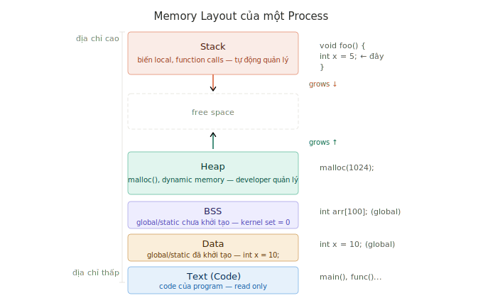
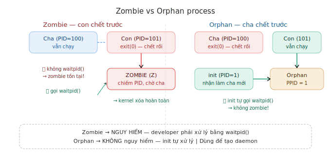

# Processes — Tổng kết kiến thức

> Tài liệu tổng kết toàn bộ kiến thức về Processes từ *The Linux Programming Interface* (TLPI) — Ch6, 24, 25, 26

---

## Mục lục

| # | Nội dung |
|---|---|
| 1 | [Tại sao Linux cần nhiều Process?](#1-tại-sao-linux-cần-nhiều-process) |
| 2 | [Memory Layout của Process](#2-memory-layout-của-process) |
| 3 | [fork()](#3-fork) |
| 4 | [exec()](#4-exec) |
| 5 | [Các cách kết thúc Process](#5-các-cách-kết-thúc-process) |
| 6 | [exit() vs _exit()](#6-exit-vs-_exit) |
| 7 | [atexit()](#7-atexit) |
| 8 | [wait() và waitpid()](#8-wait-và-waitpid) |
| 9 | [Zombie Process](#9-zombie-process) |
| 10 | [Orphan Process](#10-orphan-process) |
| 11 | [Process Credentials](#11-process-credentials) |
| 12 | [Checklist câu hỏi phỏng vấn](#12-checklist-câu-hỏi-phỏng-vấn) |
| 13 | [So sánh Linux vs STM32 Bare Metal](#13-so-sánh-linux-vs-stm32-bare-metal) |

---

## 1. Tại sao Linux cần nhiều Process?

**2 lý do cốt lõi:**

**① Đa tác vụ** — nhiều việc chạy cùng lúc:
```
Raspberry Pi chạy đồng thời:
- sensor_reader  → đọc sensor mỗi giây
- web_server     → hiển thị data lên browser
- sshd           → cho phép remote vào debug
```

**② Cô lập** — bug của process này không ảnh hưởng process khác:
```
FreeRTOS tasks: share cùng RAM → task A bug → crash toàn hệ thống
Linux processes: memory riêng  → process A bug → chỉ kill process A
```

> **So sánh STM32:** FreeRTOS có đa tác vụ nhưng không có cô lập — tất cả tasks share cùng RAM. Linux process an toàn hơn vì mỗi process có memory riêng.

---

## 2. Memory Layout của Process



**5 vùng nhớ từ địa chỉ thấp lên cao:**

| Vùng | Nội dung | Quản lý | Ví dụ |
|---|---|---|---|
| Text | Code của program | Kernel (read-only) | `main()`, `func()` |
| Data | Global/static đã khởi tạo | Kernel | `int x = 10;` (global) |
| BSS | Global/static chưa khởi tạo | Kernel (set = 0) | `int arr[100];` (global) |
| Heap | Dynamic memory | Developer | `malloc(1024)` |
| Stack | Biến local, function calls | Tự động | `int x = 5;` (local) |

**Stack và Heap grow về phía nhau:**
```
Stack grows ↓ (địa chỉ giảm)
Heap  grows ↑ (địa chỉ tăng)
→ Đệ quy quá sâu hoặc malloc quá nhiều → Stack Overflow!
```

**Copy-on-Write (CoW) sau fork():**
```
fork() không copy memory ngay lập tức
→ Cha và con share cùng trang nhớ (read-only)
→ Chỉ khi ghi vào → kernel mới copy trang đó
→ Tiết kiệm RAM và thời gian!
```

---

## 3. fork()

> **Khái niệm:** Tạo process con là bản copy của process cha tại thời điểm gọi fork(). Process con bắt đầu chạy ngay từ dòng sau fork() — không chạy lại từ đầu.

> **Lưu ý:**
> - fork() return **2 lần** — 1 lần trong cha, 1 lần trong con
> - Cha nhận PID của con (> 0), con nhận 0
> - Flush stdio buffer trước fork() để tránh ghi trùng
> - Luôn gọi waitpid() sau fork() để tránh zombie
> - Fork bomb: vòng lặp fork() vô tận → crash hệ thống

```c
#include <unistd.h>
pid_t fork(void);
// Returns: PID của con (trong cha), 0 (trong con), -1 (lỗi)
```

**Pattern chuẩn:**
```c
fflush(stdout);           // flush trước fork()!

pid_t pid = fork();

if (pid == -1) {
    perror("fork()");
    exit(1);

} else if (pid == 0) {
    // ── Process con ──
    printf("Con, PID: %d, PPID: %d\n", getpid(), getppid());
    _exit(0);             // dùng _exit() trong con!

} else {
    // ── Process cha ──
    printf("Cha, PID con: %d\n", pid);
    waitpid(pid, NULL, 0);
}
```

**Process con kế thừa từ cha:**
```
✅ Memory layout (CoW)      ✅ fd table (trỏ cùng open file entry)
✅ Signal handlers          ✅ UID, GID
✅ umask, working directory ✅ Giá trị biến tại thời điểm fork()
❌ PID (con có PID riêng)   ❌ Thời gian CPU (reset về 0)
❌ File locks (flock)       ❌ Memory locks
```

**fd table sau fork() — liên kết 3 tầng bảng:**
```
Process cha          Process con
fd table (tầng 1)    fd table (tầng 1)  ← COPY riêng
     │                    │
     └──────────┬──────────┘
                ▼
      Open file table (tầng 2)          ← SHARE — share offset!
                ▼
         Inode (tầng 3)                 ← SHARE
```

**Command line:**
```bash
ps aux          # xem tất cả process
pstree -p       # xem dạng cây cha-con
ps -o pid,ppid  # xem PID và PPID
```

---

## 4. exec()

> **Khái niệm:** Thay thế chương trình đang chạy trong process hiện tại bằng chương trình khác. PID không đổi nhưng toàn bộ memory layout bị thay thế hoàn toàn.

> **Lưu ý:**
> - exec() **không bao giờ return** nếu thành công — không còn stack để return về
> - Nếu thất bại → return -1, xử lý lỗi rồi exit()
> - fd table được kế thừa (trừ fd có FD_CLOEXEC)
> - Signal handlers reset về default sau exec()

```c
#include <unistd.h>

execl (path, arg0, arg1, ..., NULL)   // list args, path đầy đủ
execlp(file, arg0, arg1, ..., NULL)   // list args, tìm trong PATH
execv (path, argv[])                  // array args, path đầy đủ
execvp(file, argv[])                  // array args, tìm trong PATH
```

**Giải thích tham số:**
```c
execl("/bin/ls", "ls", "-la", "/home", NULL);
//     ↑          ↑     ↑      ↑        ↑
//  đường dẫn  argv[0] argv[1] argv[2]  kết thúc bắt buộc
```

**Dùng program của chính mình:**
```c
execl("./worker", "worker", "hello", NULL);
//     ↑
//  ./ = thư mục hiện tại
```

**Pattern fork() + exec():**
```c
pid_t pid = fork();

if (pid == 0) {
    // Setup trước khi exec (redirect fd, permissions...)
    int fd = open("output.txt", O_WRONLY | O_CREAT, 0644);
    dup2(fd, 1);    // redirect stdout → file
    close(fd);

    execl("/bin/ls", "ls", "-la", NULL);

    // Chỉ chạy đến đây nếu exec() thất bại!
    perror("execl()");
    exit(1);

} else {
    waitpid(pid, NULL, 0);
}
```

---

## 5. Các cách kết thúc Process

### Kết thúc bình thường
```c
return 0;     // từ main() — compiler chuyển thành exit(0)
exit(0);      // kết thúc bình thường, flush stdio buffer
_exit(0);     // thoát ngay, KHÔNG flush stdio buffer
```

### Kết thúc bất thường
```c
abort();      // gửi SIGABRT → kết thúc ngay
// hoặc bị signal từ bên ngoài:
// kill -9 PID  → SIGKILL
// Ctrl+C       → SIGINT
// Segfault     → SIGSEGV
```

**Liên kết với waitpid() macros:**
```
Kết thúc bình thường → WIFEXITED() = true  → WEXITSTATUS()
Kết thúc bất thường  → WIFSIGNALED() = true → WTERMSIG()
```

---

## 6. exit() vs _exit()

> **Khái niệm:** exit() dọn dẹp user space trước khi báo kernel. _exit() báo kernel ngay lập tức, bỏ qua mọi dọn dẹp user space.

> **Lưu ý:**
> - Process con sau fork() nên dùng **_exit()** — tránh flush stdio buffer 2 lần
> - exit() gọi _exit() bên dưới — _exit() là syscall thật
> - Signal và crash không gọi exit() — atexit handlers không được gọi!

```
exit(0)                        _exit(0)
  ↓                              ↓
① Gọi atexit() handlers      Thẳng vào kernel
  ↓                              ↓
② fflush() stdio buffers      Kernel dọn dẹp:
  ↓                            - đóng fd
③ Gọi _exit(0)               - giải phóng memory
  ↓                            - xóa process
Kernel dọn dẹp
```

**Ví dụ minh họa:**
```c
// exit() — flush buffer → in ra
int main() {
    printf("Hello");   // không có \n → nằm trong buffer
    exit(0);           // flush → "Hello" được in
}   // Output: Hello

// _exit() — không flush → mất data
int main() {
    printf("Hello");   // không có \n → nằm trong buffer
    _exit(0);          // không flush → "Hello" biến mất
}   // Output: (không có gì!)
```

---

## 7. atexit()

> **Khái niệm:** Đăng ký hàm cleanup tự động gọi khi program kết thúc bằng exit() hoặc return. Giải quyết vấn đề quên dọn dẹp khi có nhiều điểm thoát.

> **Lưu ý:**
> - Các hàm được gọi theo thứ tự **LIFO** (đăng ký sau → gọi trước)
> - Chỉ được gọi bởi exit() và return — không được gọi bởi _exit(), signal, crash
> - Tối đa 32 hàm có thể đăng ký (POSIX)

```c
#include <stdlib.h>
int atexit(void (*func)(void));
```

**Ví dụ:**
```c
void close_log() {
    fsync(log_fd);
    close(log_fd);
    unlink("/var/lock/app.lock");  // xóa lock file!
}

int main() {
    atexit(close_log);  // đăng ký một lần — không lo quên!
    // ... chạy chương trình
}
```

---

## 8. wait() và waitpid()

> **Khái niệm:** Cho phép process cha chờ process con kết thúc và lấy exit status. Ngăn chặn zombie process bằng cách collect thông tin của con.

> **Lưu ý:**
> - Luôn gọi waitpid() sau fork() để tránh zombie
> - Luôn check WIFEXITED() trước khi gọi WEXITSTATUS()
> - Truyền NULL thay vì &status nếu không cần exit status
> - waitpid(-1) = wait bất kỳ con nào

```c
#include <sys/wait.h>

pid_t wait(int *status);                        // chờ bất kỳ con
pid_t waitpid(pid_t pid, int *status, int options); // chờ con cụ thể
```

**Options:**
```c
waitpid(pid, &status, 0);        // blocking — chờ đến khi con xong
waitpid(pid, &status, WNOHANG);  // nonblocking — return ngay
waitpid(-1,  &status, 0);        // chờ bất kỳ con nào
```

**Macros kiểm tra exit status:**

| Macro | Ý nghĩa | Dùng sau |
|---|---|---|
| `WIFEXITED(s)` | Con thoát bình thường? | — |
| `WEXITSTATUS(s)` | Lấy exit code | WIFEXITED |
| `WIFSIGNALED(s)` | Con bị kill bởi signal? | — |
| `WTERMSIG(s)` | Lấy signal number | WIFSIGNALED |

**Pattern đầy đủ:**
```c
int status;
pid_t done = waitpid(pid, &status, 0);

if (WIFEXITED(status)) {
    int code = WEXITSTATUS(status);
    printf("Con kết thúc, exit code: %d\n", code);

} else if (WIFSIGNALED(status)) {
    printf("Con bị kill bởi signal: %d\n", WTERMSIG(status));
}
```

**Quy ước exit code:**

| Code | Ý nghĩa |
|---|---|
| 0 | Thành công |
| 1 | Lỗi chung |
| 127 | Command not found |
| 128+n | Bị kill bởi signal n |

```bash
./myprogram
echo $?    # xem exit code của lệnh vừa chạy
```

---

## 9. Zombie Process



> **Khái niệm:** Process con đã kết thúc nhưng cha chưa gọi waitpid() để collect exit status. Kernel giữ lại PID và exit status trong process table chờ cha.

> **Lưu ý:**
> - Zombie không tốn RAM hay CPU — chỉ tốn **PID**
> - PID tối đa = 32768 — zombie tích lũy đủ → fork() thất bại
> - Zombie nguy hiểm với embedded device chạy 24/7
> - Nhận biết: trạng thái `Z` trong `ps aux`

**Tại sao nguy hiểm:**
```
Zombie chiếm PID mãi mãi
→ PID tối đa = 32768
→ Hết PID → fork() thất bại với EAGAIN
→ Không tạo được process mới
→ Hệ thống tê liệt!
```

**3 cách tránh zombie:**

```c
// ① Blocking waitpid()
waitpid(pid, &status, 0);

// ② Nonblocking trong vòng lặp
while(1) {
    pid_t done = waitpid(-1, &status, WNOHANG);
    if (done > 0)
        printf("Con %d xong\n", done);
    sleep(1);
}

// ③ Ignore SIGCHLD — kernel tự xóa con
#include <signal.h>
signal(SIGCHLD, SIG_IGN);
```

**Debug:**
```bash
ps aux | grep Z        # xem zombie (trạng thái Z)
ps aux | grep defunct  # cách khác xem zombie
```

---

## 10. Orphan Process

> **Khái niệm:** Process con vẫn đang chạy nhưng process cha đã kết thúc. Kernel tự động giao process con cho init (PID=1) làm cha mới.

> **Lưu ý:**
> - Orphan **không nguy hiểm** — init tự collect khi con kết thúc
> - PPID của orphan = 1 (init)
> - Đây là kỹ thuật tạo **daemon** có chủ đích

**Kỹ thuật tạo daemon:**
```c
pid_t pid = fork();
if (pid > 0) {
    exit(0);    // cha kết thúc → con thành orphan
}
// Con được init nhận → chạy nền mãi mãi → daemon!
setsid();       // tạo session mới — tách khỏi terminal
```

**Debug:**
```bash
pstree -p                    # xem process tree
ps -o pid,ppid,cmd | grep 1  # xem process có PPID=1
```

---

## 11. Process Credentials

> **Khái niệm:** Thông tin định danh của process — kernel dùng để kiểm tra quyền truy cập file và tài nguyên.

> **Lưu ý:**
> - Process con kế thừa UID/GID từ cha
> - UID=0 (root) bỏ qua mọi permission check
> - Effective UID (eUID) là thứ kernel dùng để check — không phải real UID
> - SUID bit: cho phép program chạy với UID của owner file

```c
#include <unistd.h>

pid_t pid  = getpid();    // PID của process hiện tại
pid_t ppid = getppid();   // PID của process cha
uid_t uid  = getuid();    // Real User ID
uid_t euid = geteuid();   // Effective User ID
gid_t gid  = getgid();    // Real Group ID
```

**Kernel check permissions dựa vào credentials:**
```
Process gọi open("file.txt", O_RDONLY):
    eUID == owner của file? → dùng owner permissions
    eGID == group của file? → dùng group permissions
    Không match?            → dùng other permissions
    eUID == 0 (root)?       → cho phép tất cả!
```

**SUID bit — chạy với quyền owner:**
```bash
ls -la /usr/bin/passwd
# -rwsr-xr-x root root /usr/bin/passwd
#     ↑ s = SUID bit

# User alice (UID=1000) chạy passwd:
# → eUID = 0 (root) vì SUID bit
# → passwd có thể ghi vào /etc/shadow
```

**Drop privileges — pattern an toàn:**
```c
// Mở port 80 (cần root)
int sock = open_port(80);

// Drop về user thường ngay sau đó
setuid(1000);   // eUID = 1000

// Từ giờ chạy với quyền user thường — an toàn hơn!
serve_requests(sock);
```

**Command line:**
```bash
id                        # xem UID, GID của mình
ps -o pid,uid,gid,cmd     # xem credentials của processes
find / -perm -4000        # tìm file có SUID bit
```

---

## 12. Checklist câu hỏi phỏng vấn

**Memory Layout:**
- [ ] 5 vùng nhớ của process là gì? Vùng nào nằm ở địa chỉ cao/thấp?
- [ ] Stack và Heap khác nhau thế nào về cách quản lý?
- [ ] Copy-on-Write là gì? Tại sao fork() dùng CoW?

**fork():**
- [ ] fork() return mấy lần? Cha và con nhận giá trị gì?
- [ ] Process con kế thừa những gì từ cha?
- [ ] Tại sao cần flush stdio buffer trước fork()?
- [ ] fd table sau fork() — share hay copy?

**exec():**
- [ ] exec() làm gì với memory layout?
- [ ] Tại sao exec() không return khi thành công?
- [ ] Sự khác nhau giữa execl() và execvp()?

**Kết thúc process:**
- [ ] Sự khác nhau giữa exit() và _exit()?
- [ ] Tại sao process con sau fork() dùng _exit()?
- [ ] atexit() có được gọi khi bị signal không?

**waitpid():**
- [ ] Zombie process là gì? Tại sao nguy hiểm?
- [ ] Orphan process là gì? Khác zombie thế nào?
- [ ] 3 cách tránh zombie process?
- [ ] WIFEXITED() và WIFSIGNALED() dùng khi nào?

**Credentials:**
- [ ] UID và GID dùng để làm gì?
- [ ] SUID bit là gì? Ví dụ thực tế?
- [ ] Real UID và Effective UID khác nhau thế nào?

---

## 13. So sánh Linux vs STM32 Bare Metal

| | STM32 FreeRTOS | Linux Process |
|---|---|---|
| Tạo task/process | xTaskCreate() từ đầu | fork() — copy từ cha |
| Memory riêng | Không — share RAM | Có — CoW |
| Cô lập | Không | Có |
| Bug crash | Toàn hệ thống | Chỉ process đó |
| Đa tác vụ | Có (RTOS scheduling) | Có (kernel scheduling) |
| User/permissions | Không | Có (UID/GID) |
| Process tree | Không | Có (init → cha → con) |
| Zombie | Không | Có — developer phải xử lý |

---

*Tài liệu tổng kết từ TLPI Ch6, 24, 25, 26*
